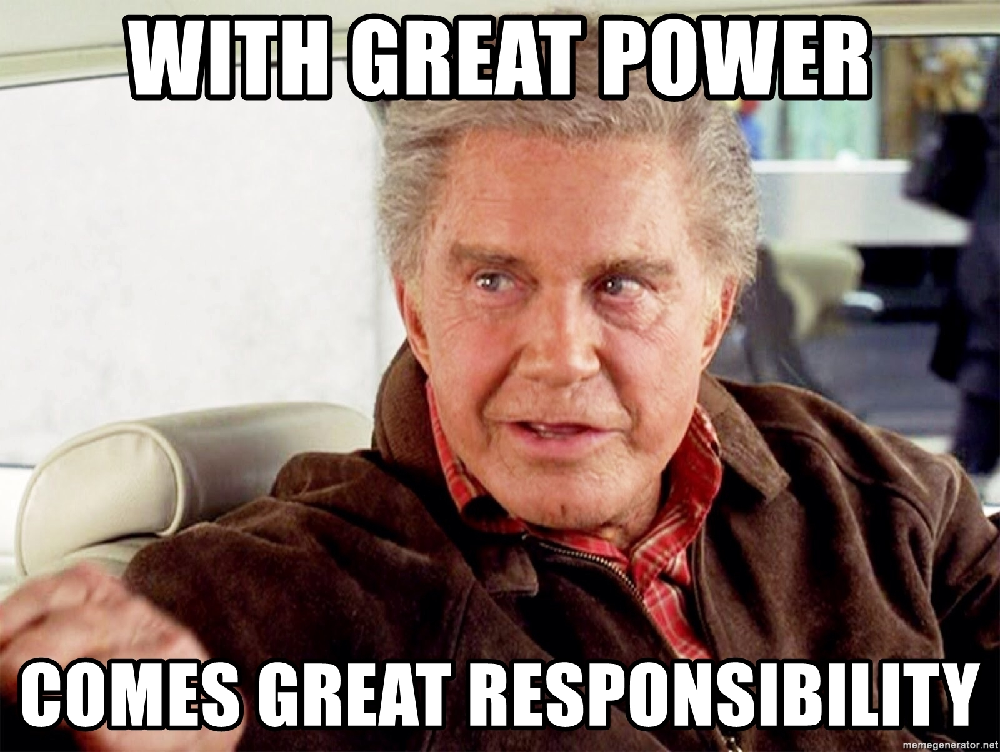

# Ownership
## July 5th, 2021

# Introduction

There are many good ways to engineer software, and many many more bad ways to
engineer software.  I have become increasingly convinced, however, that the
most reliable way to distinguish between the two groups is analyzing ownership.

Ownership is about responsibility and control.  Healthy ownership encourages a
degree of pride in the work, the sort of thing that incentivizes people to go
the extra mile to make the thing good, not merely good enough.  Healthy owners
feel a responsibility in this regard.  On the other side of the coin, ownership
of this sort is impossible if people are not empowered to make their own
decisions about what they work on, what technologies and tools they use, and on
what schedule they deliver this work.  Healthy ownership can be destroyed by
insufficient resources or degrees of engineering freedom, as giving a shit
about something over which you have no control is almost impossible.

Have you ever noticed a suffering project at your company and said to yourself
"why don't they seem to care?".  Or, "if *I* was on that team, surely I would
not let it get this bad!".  These are the surefire signs of poor ownership
incentives.  It is not always the team's *fault* for this sort of outcome,
oftentimes the negative behaviors that cause this are subconscious or difficult
to fight against because they are the result of poorly aligned incentives.
This also means that if you can move the needle and encourage ownership, you
can help this team fix all of these issues.

# Why Ownership?

There are very few jobs performed by humans that would not be improved by an
attitude of ownership.  Think about the most boring and menial job you can
imagine.  Now, imagine two people performing that task.  Picture one person
says "I take pride in everything I do, and want to always do a good job that
other people will respect and wish to emulate".  Now, imagine someone else
saying "Meh, I did the job, I met all the requirements, now it's done and I
hope I never have to think about it again."  Which of those people do you
suppose is going to do a better job?  Presumably, you don't imagine they are
likely to both perform the task equally well.

Now, I would not begin to argue that people should do more for less pay, or
perform extra work which was not included in the project requirements and whose
results don't matter.  This mindset feeds directly into the exploitative
always-working software startup subculture, and this is perpendicular to and
unnecessary for the ownership practices for which I am advocating.  That said,
often times the extra work done in the name of good ownership incentives *does*
matter.  In the arena of software engineering, in fact, the extra work matters
a lot, because when you just do the minimum, you accrue technical debt.  Sales
clerks, janitors, and factory workers do not, in general, accrue technical
debt.  Building a widget today does not impact building a widget tomorrow.
However, almost all software written will be maintained and modified at some
point in the future by either the author, or a future software engineer.
Furthermore, you often can't tell which software will need this work and which
will never be changed before it is deprecated and completely removed from
production, and the cost of cutting corners and generating technical debt is so
high that it is almost certainly better to assume all software falls into the
former category.

_Thinking like an owner_ does not just make people do a little extra, it helps
align people's desires with what is actually best for the thing they own, at
the project level, the team level, and even the entire organization.  When I
have ownership in my company (via equity, profit-sharing, or similar long-term
incentive structures) it helps me think of the value I deliver to the
organization in terms of what will be best for the organization, not just what
is best for me or my career, because those two things align more closely.  This
is why software companies have these equity incentive structures to begin with.
Similarly, when I have the responsibility as well as the control to determine
the fate of my own team and our projects, then I know that my success and the
success of the team and our projects are also aligned.

# The Drawbacks of Ownership

In my career, you might say, I've *seen some shit*.  And if I had to break it
all down, I've seen too little ownership quite frequently, and I struggle to
come up with examples where I have seen too much ownership.  That said, some
negative consequences I have experienced due to people acting like an owner to
a slightly higher extreme than may be warranted include:

* Rejecting out-group contributions out of hand or unnecessarily ("We can't
  support that / it's too much work / it isn't how we would have done it / it
  doesn't meet our bar for quality")
* Allowing perfect to be the enemy of good ("Feature X is not ready to deploy
  because it still has problem X" - sometimes a good thing but bad when taken
  to an extreme)
* Lack of openness to minority customer concerns (the 5% usecase still matters
  sometimes, even if 95% of customers don't care)
* TODO: more?

# How to Transform Ownership

OK, so presumably you are now convinced that insufficient ownership is at least
partially related to what ails your team, and may be a lever you can pull to
improve the functioning of your organization.  Every organization is different,
so it is difficult to make generally applicable suggestions, but there are a
few techniques I have seen or heard of working to increase ownership throughout
various organizations.

## Empower teams to choose their own goals and timelines

While it is important that management is aware of the plan, and ensures the
company is aligned, teams should feel like they have considerable control to
decide how, with what technology, and on what timeline work will be
accomplished.  Choosing OKRs (Objectives and Key Results) should be a
bidirectional conversation between leaf workers and middle management all the
way up to the senior leadership team.  If the SLT does not understand why the
team wants to do something else, that is a failure.  If the team does not
understand why SLT is pushing an agenda with which they disagree, that is also
a failure.

## Hold teams accountable for their results

Make it clear that with great empowerment comes great responsibility.  Hang up some Uncle Ben Memes!

If the team makes poor choices and things don't go well, then it is an
opportunity to learn and make better choices next time.  If the team makes good
choices and delivers a lot of value, however, they get to claim all the credit
for that victory (and the impact it has on their resume and career).  Nobody
wants to be held accountable for decisions outside their control, but holding
people accountable to the decisions they are empowered to make is how you write
a powerful resume and drive a successful career to senior, staff, principal,
and beyond.

Establishing this expectation, then standing by it, is also about aligning
incentives.  People who make careful evidence-backed decisions, whether
successful or not, will be learning and building their skills, and are likely
to eventually be very successful.  When they succeed, they build their career
and deliver value to the organization at the same time.

## Think about individual incentives and how they drive ownership

This one is a little backwards.  Ownership is good because it drives incentive
alignment.  Incentive alignment can drive ownership too though!  Don't ever let
anyone tell you people are not motivated by incentives.  Consciously and
subconsciously, everyone is motivated by incentives to some degree.  If your
organization has a very short review cycle, for example, is it possible you are
not properly incentivizing (and rewarding) long-term thinking?  On the other
hand, if your review cycle is very long, do the small tasks associated with
strong ownership that people do every day (such as fixing small but annoying
problems, paying down tech debt in small incremental changes) get lost in the
shuffle?  You want to ensure that incentives for ownership are prominent and
visible in the process for performance evaluation as well as career
expectations and growth opportunities.

* Ensure ownership is an explicit job function for all SWE roles, with growing responsibilities and expectations for more senior positions
* Ensure that SWE performance evaluation includes SMART goals related to ownership
* Ensure aspects of ownership are included in growth discussions as a skill to be developed

# The Amazon Connection

I've been a software engineer of one sort or another for nearly two decades.
My professional career really started in 2006, however, with my first job after
college at Amazon.com.  Amazon was an incredible place to cut my teeth and get
experience with nearly unheard of scale of software and internal tools.  I
watched Amazon launch the very first AWS services, as well as other services
that would become technological revolutions unto themselves such as the digital
music and video stores, and the very first Kindle.  It was an incredible time
to be a part of what was then just a "scrappy" $30B internet company and online
retailer.  (Obligatory:  If only I had held the stock!!!)

I learned many important lessons at Amazon, but none have shaped my career and
my talents as an engineer as thoroughly as my predilection for software
ownership.  At Amazon, "think like an owner" is a core engineering principle
and normalized and required job responsibility.  As a young and impressionable
engineer, I drank that koolaid without question.  As my career has progressed,
however, I have had many chances to think critically about it.

I always approach software engineering from the perspective of a strong owner
of my projects, my team, and my company.  This attitude has served me well and
I continue to proselytize the ownership mindset whenever possible.  I've come
to believe that it is often one of the clearest indicators of how effectively
software teams operate within their organization, and I hope this post has
helped you to see why.

====

Title: Ownership
Date: 2021-07-05
Tags:  ownership, programming, software engineering, management
